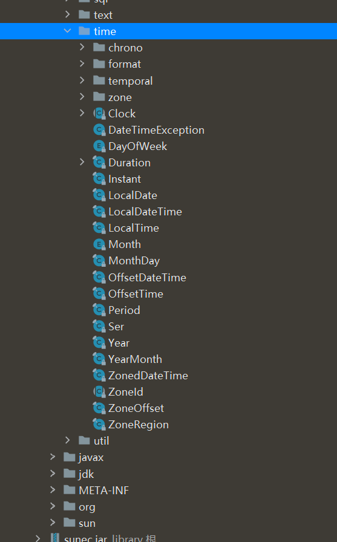

## 新日期和时间API

### 旧版日期时间API问题

* 设计很差： 在java.util和java.sql的包中都有日期类，java.util.Date同时包含日期和时间，而java.sql.Date仅包含日期。此外用于格式化和解析的类在java.text包中定义
* 非线程安全：java.util.Date 是非线程安全的，所有的日期类都是可变的，这是Java日期类最大的问题之一
* 时区处理麻烦：日期类并不提供国际化，没有时区支持，因此Java引入了java.util.Calendar和 java.util.TimeZone类，但他们同样存在上述所有的问题


### 概述

JDK8中增加了一套全新的日期时间API，这套API设计合理，是线程安全的。新的日期及时间API位于java.time包中





* LocalDate ：表示日期，包含年月日，格式为 2019-10-16
* LocalTime ：表示时间，包含时分秒，格式为 16:38:54.158549300
* LocalDateTime ：表示日期时间，包含年月日，时分秒
* DateTimeFormatter ：日期时间格式化类
* Instant：时间戳，表示一个特定的时间瞬间
* Duration：用于计算2个时间(LocalTime，时分秒)的距离
* Period：用于计算2个日期(LocalDate，年月日)的距离
* ZonedDateTime ：包含时区的时间


 Java中使用的历法是ISO 8601日历系统，它是世界民用历法，也就是我们所说的公历。平年有365天，闰年是366 天。此外Java 8还提供了4套其他历法：

* ThaiBuddhistDate ：泰国佛教历
* MinguoDate ：中华民国历
* JapaneseDate：日本历
* HijrahDate：伊斯兰历


优势：

* 新版的日期和时间API中，日期和时间对象是不可变的。操纵的日期不会影响老值，而是新生成一个实例
* 新的API提供了两种不同的时间表示方式，有效地区分了人和机器的不同需求
* TemporalAdjuster可以更精确的操纵日期，还可以自定义日期调整器
* 是线程安全的


```java
package mao;

import java.time.LocalDate;
import java.time.chrono.HijrahDate;
import java.time.chrono.JapaneseDate;
import java.time.chrono.MinguoDate;
import java.time.chrono.ThaiBuddhistDate;

/**
 * Project name(项目名称)：JDK8_data_time_API
 * Package(包名): mao
 * Class(类名): Test1
 * Author(作者）: mao
 * Author QQ：1296193245
 * GitHub：https://github.com/maomao124/
 * Date(创建日期)： 2023/10/27
 * Time(创建时间)： 17:14
 * Version(版本): 1.0
 * Description(描述)： 无
 */

public class Test1
{
    public static void main(String[] args)
    {
        MinguoDate now = MinguoDate.now();
        System.out.println(now);
        System.out.println(JapaneseDate.now());
        LocalDate localDate = LocalDate.now();
        System.out.println(localDate);
        HijrahDate hijrahDate = HijrahDate.now();
        System.out.println(hijrahDate);
        ThaiBuddhistDate thaiBuddhistDate = ThaiBuddhistDate.now();
        System.out.println(thaiBuddhistDate);
    }
}
```


```sh
Minguo ROC 112-10-27
Japanese Reiwa 5-10-27
2023-10-27
Hijrah-umalqura AH 1445-04-12
ThaiBuddhist BE 2566-10-27
```


### LocalDate

```java
package mao;

import java.time.LocalDate;

/**
 * Project name(项目名称)：JDK8_data_time_API
 * Package(包名): mao
 * Class(类名): Test2
 * Author(作者）: mao
 * Author QQ：1296193245
 * GitHub：https://github.com/maomao124/
 * Date(创建日期)： 2023/10/27
 * Time(创建时间)： 17:23
 * Version(版本): 1.0
 * Description(描述)： 无
 */

public class Test2
{
    public static void main(String[] args)
    {
        //创建指定日期
        LocalDate fj = LocalDate.of(1985, 9, 23);
        System.out.println("fj = " + fj); // 1985-09-23
        //得到当前日期
        LocalDate nowDate = LocalDate.now();
        System.out.println("nowDate = " + nowDate);
        //获取日期信息
        System.out.println("年: " + nowDate.getYear());
        System.out.println("月: " + nowDate.getMonthValue());
        System.out.println("日: " + nowDate.getDayOfMonth());
        System.out.println("星期: " + nowDate.getDayOfWeek());
    }
}
```


```sh
fj = 1985-09-23
nowDate = 2023-10-28
年: 2023
月: 10
日: 28
星期: SATURDAY
```


### LocalTime

```java
package mao;

import java.time.LocalTime;

/**
 * Project name(项目名称)：JDK8_data_time_API
 * Package(包名): mao
 * Class(类名): Test3
 * Author(作者）: mao
 * Author QQ：1296193245
 * GitHub：https://github.com/maomao124/
 * Date(创建日期)： 2023/10/28
 * Time(创建时间)： 17:56
 * Version(版本): 1.0
 * Description(描述)： 无
 */

public class Test3
{
    public static void main(String[] args)
    {
        // 得到指定的时间
        LocalTime time = LocalTime.of(12, 15, 28, 129_900_000);
        System.out.println("time = " + time);
        // 得到当前时间
        LocalTime nowTime = LocalTime.now();
        System.out.println("nowTime = " + nowTime);
        // 获取时间信息
        System.out.println("小时: " + nowTime.getHour());
        System.out.println("分钟: " + nowTime.getMinute());
        System.out.println("秒: " + nowTime.getSecond());
        System.out.println("纳秒: " + nowTime.getNano());
    }
}
```


```sh
time = 12:15:28.129900
nowTime = 17:58:30.571
小时: 17
分钟: 58
秒: 30
纳秒: 571000000
```


### LocalDateTime

```java
package mao;

import java.time.LocalDateTime;

/**
 * Project name(项目名称)：JDK8_data_time_API
 * Package(包名): mao
 * Class(类名): Test4
 * Author(作者）: mao
 * Author QQ：1296193245
 * GitHub：https://github.com/maomao124/
 * Date(创建日期)： 2023/10/28
 * Time(创建时间)： 17:59
 * Version(版本): 1.0
 * Description(描述)： 无
 */

public class Test4
{
    public static void main(String[] args)
    {
        LocalDateTime fj = LocalDateTime.of(1985, 9, 23, 9, 10, 20);
        System.out.println("fj = " + fj);
        // 得到当前日期时间
        LocalDateTime now = LocalDateTime.now();
        System.out.println("now = " + now);
        System.out.println(now.getYear());
        System.out.println(now.getMonthValue());
        System.out.println(now.getDayOfMonth());
        System.out.println(now.getHour());
        System.out.println(now.getMinute());
        System.out.println(now.getSecond());
        System.out.println(now.getNano());
    }
}
```


```sh
fj = 1985-09-23T09:10:20
now = 2023-10-28T17:59:41.449
2023
10
28
17
59
41
449000000
```


### 日期时间的修改

对日期时间的修改，对已存在的LocalDate对象，创建它的修改版，最简单的方式是使用withAttribute方法

withAttribute方法会创建对象的一个副本，并按照需要修改它的属性。以下所有的方法都返回了一个修改属性的对 象，他们不会影响原来的对象

```java
package mao;

import java.time.LocalDateTime;

/**
 * Project name(项目名称)：JDK8_data_time_API
 * Package(包名): mao
 * Class(类名): Test5
 * Author(作者）: mao
 * Author QQ：1296193245
 * GitHub：https://github.com/maomao124/
 * Date(创建日期)： 2023/10/28
 * Time(创建时间)： 18:05
 * Version(版本): 1.0
 * Description(描述)： 无
 */

public class Test5
{
    public static void main(String[] args)
    {
        LocalDateTime now = LocalDateTime.now();
        System.out.println("now = " + now);
        LocalDateTime localDateTime = now.withYear(2021);
        System.out.println(localDateTime);
        System.out.println(now == localDateTime);
        System.out.println("修改月份: " + now.withMonth(8));
        System.out.println("修改小时: " + now.withHour(2));
        System.out.println("修改分钟: " + now.withMinute(13));

        LocalDateTime localDateTime1 = now.plusYears(3);
        System.out.println(localDateTime1);
        System.out.println(localDateTime1 == now);
        System.out.println("20月后: " + now.plusMonths(20));
        System.out.println("20年前: " + now.minusYears(20));
        System.out.println("5月前: " + now.minusMonths(5));
        System.out.println("100天前: " + now.minusDays(100));
        System.out.println("3周前: " + now.minusWeeks(3));
    }
}
```


```sh
now = 2023-10-28T18:10:08.748
2021-10-28T18:10:08.748
false
修改月份: 2023-08-28T18:10:08.748
修改小时: 2023-10-28T02:10:08.748
修改分钟: 2023-10-28T18:13:08.748
2026-10-28T18:10:08.748
false
20月后: 2025-06-28T18:10:08.748
20年前: 2003-10-28T18:10:08.748
5月前: 2023-05-28T18:10:08.748
100天前: 2023-07-20T18:10:08.748
3周前: 2023-10-07T18:10:08.748
```


### 日期时间的比较

在JDK8中，LocalDate类中使用isBefore()、isAfter()、equals()方法来比较两个日期，可直接进行比较


```java
package mao;

import java.time.LocalDate;

/**
 * Project name(项目名称)：JDK8_data_time_API
 * Package(包名): mao
 * Class(类名): Test6
 * Author(作者）: mao
 * Author QQ：1296193245
 * GitHub：https://github.com/maomao124/
 * Date(创建日期)： 2023/10/28
 * Time(创建时间)： 18:12
 * Version(版本): 1.0
 * Description(描述)： 无
 */

public class Test6
{
    public static void main(String[] args)
    {
        LocalDate now = LocalDate.now();
        LocalDate date = LocalDate.of(2022, 3, 14);
        System.out.println(now.isAfter(date));
        System.out.println(now.isBefore(date));
        System.out.println(now.equals(date));
        date = LocalDate.of(2029, 12, 19);
        System.out.println(now.isAfter(date));
        System.out.println(now.isBefore(date));
        System.out.println(now.equals(date));
        LocalDate date2 = LocalDate.of(2029, 12, 19);
        System.out.println(date.isAfter(date2));
        System.out.println(date.isBefore(date2));
        System.out.println(date.equals(date2));
        System.out.println(date.isEqual(date2));
    }
}
```


```sh
true
false
false
false
true
false
false
false
true
true
```


### 时间格式化与解析

通过 java.time.format.DateTimeFormatter类可以进行日期时间解析与格式化


```java
package mao;

import java.time.LocalDate;
import java.time.LocalDateTime;
import java.time.format.DateTimeFormatter;

/**
 * Project name(项目名称)：JDK8_data_time_API
 * Package(包名): mao
 * Class(类名): Test7
 * Author(作者）: mao
 * Author QQ：1296193245
 * GitHub：https://github.com/maomao124/
 * Date(创建日期)： 2023/10/28
 * Time(创建时间)： 18:18
 * Version(版本): 1.0
 * Description(描述)： 无
 */

public class Test7
{
    public static void main(String[] args)
    {
        LocalDateTime now = LocalDateTime.now();
        String format = now.format(DateTimeFormatter.ISO_LOCAL_DATE);
        System.out.println(format);
        format = now.format(DateTimeFormatter.ISO_DATE_TIME);
        System.out.println(format);
        format = now.format(DateTimeFormatter.ISO_LOCAL_DATE_TIME);
        System.out.println(format);
        format = now.format(DateTimeFormatter.ISO_TIME);
        System.out.println(format);
        format = now.format(DateTimeFormatter.ofPattern("yyyy-MM-dd HH:mm:ss"));
        System.out.println(format);
        format = now.format(DateTimeFormatter.ofPattern("yyyy/MM/dd HH:mm:ss"));
        System.out.println(format);
        LocalDateTime parse = LocalDateTime.parse("2023-10-28 18:22:18", DateTimeFormatter.ofPattern("yyyy-MM-dd HH:mm:ss"));
        System.out.println(parse);
        LocalDate parse1 = LocalDate.parse("2023-10-28");
        System.out.println(parse1);
    }
}
```


```sh
2023-10-28
2023-10-28T18:26:15.294
2023-10-28T18:26:15.294
18:26:15.294
2023-10-28 18:26:15
2023/10/28 18:26:15
2023-10-28T18:22:18
2023-10-28
```


### Instant类

Instant 时间戳/时间线，内部保存了从1970年1月1日 00:00:00以来的秒和纳秒

```java
package mao;

import java.time.Instant;

/**
 * Project name(项目名称)：JDK8_data_time_API
 * Package(包名): mao
 * Class(类名): Test8
 * Author(作者）: mao
 * Author QQ：1296193245
 * GitHub：https://github.com/maomao124/
 * Date(创建日期)： 2023/10/28
 * Time(创建时间)： 18:27
 * Version(版本): 1.0
 * Description(描述)： 无
 */

public class Test8
{
    public static void main(String[] args)
    {
        Instant now = Instant.now();
        System.out.println(now);
        System.out.println(now.getNano());
        System.out.println(now.getEpochSecond());
        System.out.println(now.toEpochMilli());
        System.out.println(System.currentTimeMillis());
        Instant instant = Instant.ofEpochSecond(5);
        System.out.println(instant);
    }
}
```


```sh
2023-10-28T10:28:41.977Z
977000000
1698488921
1698488921977
1698488922008
1970-01-01T00:00:05Z
```


### 计算日期时间差

Duration/Period类：计算日期时间差

* Duration：用于计算2个时间(LocalTime，时分秒)的距离
* Period：用于计算2个日期(LocalDate，年月日)的距离


```java
package mao;

import java.time.Duration;
import java.time.LocalDate;
import java.time.LocalDateTime;
import java.time.Period;

/**
 * Project name(项目名称)：JDK8_data_time_API
 * Package(包名): mao
 * Class(类名): Test9
 * Author(作者）: mao
 * Author QQ：1296193245
 * GitHub：https://github.com/maomao124/
 * Date(创建日期)： 2023/10/28
 * Time(创建时间)： 18:30
 * Version(版本): 1.0
 * Description(描述)： 无
 */

public class Test9
{
    public static void main(String[] args)
    {
        LocalDateTime now = LocalDateTime.now();
        LocalDateTime localDateTime = now.plusMinutes(32);
        Duration duration = Duration.between(now, localDateTime);
        System.out.println("相差的天数:" + duration.toDays());
        System.out.println("相差的小时数:" + duration.toHours());
        System.out.println("相差的分钟数:" + duration.toMinutes());
        duration = Duration.between(localDateTime, now);
        System.out.println("相差的天数:" + duration.toDays());
        System.out.println("相差的小时数:" + duration.toHours());
        System.out.println("相差的分钟数:" + duration.toMinutes());
        duration = Duration.between(now, LocalDateTime.of(2034, 10, 16, 23, 11, 14));
        System.out.println("相差的天数:" + duration.toDays());
        System.out.println("相差的小时数:" + duration.toHours());
        System.out.println("相差的分钟数:" + duration.toMinutes());
        LocalDate nowDate = LocalDate.now();
        LocalDate date = LocalDate.of(1993, 2, 3);
        Period period = Period.between(date, nowDate);
        System.out.println("相差的年:" + period.getYears());
        System.out.println("相差的月:" + period.getMonths());
        System.out.println("相差的天:" + period.getDays());
    }
}
```


```sh
相差的天数:0
相差的小时数:0
相差的分钟数:32
相差的天数:0
相差的小时数:0
相差的分钟数:-32
相差的天数:4006
相差的小时数:96147
相差的分钟数:5768861
相差的年:30
相差的月:8
相差的天:25
```


### 时间校正器

有时我们可能需要获取例如：将日期调整到“下一个月的第一天”等操作。可以通过时间校正器来进行

* TemporalAdjuster :  时间校正器
* TemporalAdjusters :  该类通过静态方法提供了大量的常用TemporalAdjuster的实现


```java
package mao;

import java.time.LocalDate;
import java.time.LocalDateTime;
import java.time.temporal.Temporal;
import java.time.temporal.TemporalAdjuster;

/**
 * Project name(项目名称)：JDK8_data_time_API
 * Package(包名): mao
 * Class(类名): Test10
 * Author(作者）: mao
 * Author QQ：1296193245
 * GitHub：https://github.com/maomao124/
 * Date(创建日期)： 2023/10/28
 * Time(创建时间)： 19:31
 * Version(版本): 1.0
 * Description(描述)： 无
 */

public class Test10
{
    public static void main(String[] args)
    {
        LocalDateTime now = LocalDateTime.now();
        TemporalAdjuster temporalAdjuster = new TemporalAdjuster()
        {
            @Override
            public Temporal adjustInto(Temporal temporal)
            {
                LocalDateTime dateTime = (LocalDateTime) temporal;
                LocalDateTime nextMonth = dateTime.plusMonths(1).withDayOfMonth(1);
                System.out.println("nextMonth = " + nextMonth);
                return nextMonth;
            }
        };
        LocalDateTime nextMonth = now.with(temporalAdjuster);
        System.out.println("nextMonth = " + nextMonth);
        nextMonth = LocalDateTime.of(2034, 10, 16, 23, 11, 14).with(temporalAdjuster);
        System.out.println("nextMonth = " + nextMonth);
    }
}
```


```sh
nextMonth = 2023-11-01T19:35:12.744
nextMonth = 2023-11-01T19:35:12.744
nextMonth = 2034-11-01T23:11:14
nextMonth = 2034-11-01T23:11:14
```


### 设置日期时间的时区

Java8 中加入了对时区的支持，LocalDate、LocalTime、LocalDateTime是不带时区的，带时区的日期时间类分别为：ZonedDate、ZonedTime、ZonedDateTime

其中每个时区都对应着 ID，ID的格式为 “区域/城市” 。例如 ：Asia/Shanghai等

ZoneId：该类中包含了所有的时区信息

```java
package mao;

import java.time.Clock;
import java.time.ZoneId;
import java.time.ZonedDateTime;
import java.util.Iterator;
import java.util.Set;

/**
 * Project name(项目名称)：JDK8_data_time_API
 * Package(包名): mao
 * Class(类名): Test11
 * Author(作者）: mao
 * Author QQ：1296193245
 * GitHub：https://github.com/maomao124/
 * Date(创建日期)： 2023/10/28
 * Time(创建时间)： 19:37
 * Version(版本): 1.0
 * Description(描述)： 无
 */

public class Test11
{
    public static void main(String[] args)
    {
        Set<String> availableZoneIds = ZoneId.getAvailableZoneIds();
        Iterator<String> iterator = availableZoneIds.iterator();
        for (int i = 0; i < availableZoneIds.size(); i++)
        {
            if (i % 5 == 0 && i != 0)
            {
                System.out.println(iterator.next());
                continue;
            }
            System.out.print(iterator.next() + "\t");
        }
        ZonedDateTime bz = ZonedDateTime.now(Clock.systemUTC());
        System.out.println("bz = " + bz);
        ZonedDateTime now1 = ZonedDateTime.now();
        System.out.println("now1 = " + now1);
        ZonedDateTime now2 = ZonedDateTime.now(ZoneId.of("America/Atka"));
        System.out.println("now2 = " + now2);
    }
}
```


```sh
Asia/Aden	America/Cuiaba	Etc/GMT+9	Etc/GMT+8	Africa/Nairobi	America/Marigot
Asia/Aqtau	Pacific/Kwajalein	America/El_Salvador	Asia/Pontianak	Africa/Cairo
Pacific/Pago_Pago	Africa/Mbabane	Asia/Kuching	Pacific/Honolulu	Pacific/Rarotonga
America/Guatemala	Australia/Hobart	Europe/London	America/Belize	America/Panama
Asia/Chungking	America/Managua	America/Indiana/Petersburg	Asia/Yerevan	Europe/Brussels
GMT	Europe/Warsaw	America/Chicago	Asia/Kashgar	Chile/Continental
Pacific/Yap	CET	Etc/GMT-1	Etc/GMT-0	Europe/Jersey
America/Tegucigalpa	Etc/GMT-5	Europe/Istanbul	America/Eirunepe	Etc/GMT-4
America/Miquelon	Etc/GMT-3	Europe/Luxembourg	Etc/GMT-2	Etc/GMT-9
America/Argentina/Catamarca	Etc/GMT-8	Etc/GMT-7	Etc/GMT-6	Europe/Zaporozhye
Canada/Yukon	Canada/Atlantic	Atlantic/St_Helena	Australia/Tasmania	Libya
Europe/Guernsey	America/Grand_Turk	Asia/Samarkand	America/Argentina/Cordoba	Asia/Phnom_Penh
Africa/Kigali	Asia/Almaty	US/Alaska	Asia/Dubai	Europe/Isle_of_Man
America/Araguaina	Cuba	Asia/Novosibirsk	America/Argentina/Salta	Etc/GMT+3
Africa/Tunis	Etc/GMT+2	Etc/GMT+1	Pacific/Fakaofo	Africa/Tripoli
Etc/GMT+0	Israel	Africa/Banjul	Etc/GMT+7	Indian/Comoro
Etc/GMT+6	Etc/GMT+5	Etc/GMT+4	Pacific/Port_Moresby	US/Arizona
Antarctica/Syowa	Indian/Reunion	Pacific/Palau	Europe/Kaliningrad	America/Montevideo
Africa/Windhoek	Asia/Karachi	Africa/Mogadishu	Australia/Perth	Brazil/East
Etc/GMT	Asia/Chita	Pacific/Easter	Antarctica/Davis	Antarctica/McMurdo
Asia/Macao	America/Manaus	Africa/Freetown	Europe/Bucharest	Asia/Tomsk
America/Argentina/Mendoza	Asia/Macau	Europe/Malta	Mexico/BajaSur	Pacific/Tahiti
Africa/Asmera	Europe/Busingen	America/Argentina/Rio_Gallegos	Africa/Malabo	Europe/Skopje
America/Catamarca	America/Godthab	Europe/Sarajevo	Australia/ACT	GB-Eire
Africa/Lagos	America/Cordoba	Europe/Rome	Asia/Dacca	Indian/Mauritius
Pacific/Samoa	America/Regina	America/Fort_Wayne	America/Dawson_Creek	Africa/Algiers
Europe/Mariehamn	America/St_Johns	America/St_Thomas	Europe/Zurich	America/Anguilla
Asia/Dili	America/Denver	Africa/Bamako	Europe/Saratov	GB
Mexico/General	Pacific/Wallis	Europe/Gibraltar	Africa/Conakry	Africa/Lubumbashi
Asia/Istanbul	America/Havana	NZ-CHAT	Asia/Choibalsan	America/Porto_Acre
Asia/Omsk	Europe/Vaduz	US/Michigan	Asia/Dhaka	America/Barbados
Europe/Tiraspol	Atlantic/Cape_Verde	Asia/Yekaterinburg	America/Louisville	Pacific/Johnston
Pacific/Chatham	Europe/Ljubljana	America/Sao_Paulo	Asia/Jayapura	America/Curacao
Asia/Dushanbe	America/Guyana	America/Guayaquil	America/Martinique	Portugal
Europe/Berlin	Europe/Moscow	Europe/Chisinau	America/Puerto_Rico	America/Rankin_Inlet
Pacific/Ponape	Europe/Stockholm	Europe/Budapest	America/Argentina/Jujuy	Australia/Eucla
Asia/Shanghai	Universal	Europe/Zagreb	America/Port_of_Spain	Europe/Helsinki
Asia/Beirut	Asia/Tel_Aviv	Pacific/Bougainville	US/Central	Africa/Sao_Tome
Indian/Chagos	America/Cayenne	Asia/Yakutsk	Pacific/Galapagos	Australia/North
Europe/Paris	Africa/Ndjamena	Pacific/Fiji	America/Rainy_River	Indian/Maldives
Australia/Yancowinna	SystemV/AST4	Asia/Oral	America/Yellowknife	Pacific/Enderbury
America/Juneau	Australia/Victoria	America/Indiana/Vevay	Asia/Tashkent	Asia/Jakarta
Africa/Ceuta	Asia/Barnaul	America/Recife	America/Buenos_Aires	America/Noronha
America/Swift_Current	Australia/Adelaide	America/Metlakatla	Africa/Djibouti	America/Paramaribo
Asia/Qostanay	Europe/Simferopol	Europe/Sofia	Africa/Nouakchott	Europe/Prague
America/Indiana/Vincennes	Antarctica/Mawson	America/Kralendijk	Antarctica/Troll	Europe/Samara
Indian/Christmas	America/Antigua	Pacific/Gambier	America/Indianapolis	America/Inuvik
America/Iqaluit	Pacific/Funafuti	UTC	Antarctica/Macquarie	Canada/Pacific
America/Moncton	Africa/Gaborone	Pacific/Chuuk	Asia/Pyongyang	America/St_Vincent
Asia/Gaza	Etc/Universal	PST8PDT	Atlantic/Faeroe	Asia/Qyzylorda
Canada/Newfoundland	America/Kentucky/Louisville	America/Yakutat	Asia/Ho_Chi_Minh	Antarctica/Casey
Europe/Copenhagen	Africa/Asmara	Atlantic/Azores	Europe/Vienna	ROK
Pacific/Pitcairn	America/Mazatlan	Australia/Queensland	Pacific/Nauru	Europe/Tirane
Asia/Kolkata	SystemV/MST7	Australia/Canberra	MET	Australia/Broken_Hill
Europe/Riga	America/Dominica	Africa/Abidjan	America/Mendoza	America/Santarem
Kwajalein	America/Asuncion	Asia/Ulan_Bator	NZ	America/Boise
Australia/Currie	EST5EDT	Pacific/Guam	Pacific/Wake	Atlantic/Bermuda
America/Costa_Rica	America/Dawson	Asia/Chongqing	Eire	Europe/Amsterdam
America/Indiana/Knox	America/North_Dakota/Beulah	Africa/Accra	Atlantic/Faroe	Mexico/BajaNorte
America/Maceio	Etc/UCT	Pacific/Apia	GMT0	America/Atka
Pacific/Niue	Australia/Lord_Howe	Europe/Dublin	Pacific/Truk	MST7MDT
America/Monterrey	America/Nassau	America/Jamaica	Asia/Bishkek	America/Atikokan
Atlantic/Stanley	Australia/NSW	US/Hawaii	SystemV/CST6	Indian/Mahe
Asia/Aqtobe	America/Sitka	Asia/Vladivostok	Africa/Libreville	Africa/Maputo
Zulu	America/Kentucky/Monticello	Africa/El_Aaiun	Africa/Ouagadougou	America/Coral_Harbour
Pacific/Marquesas	Brazil/West	America/Aruba	America/North_Dakota/Center	America/Cayman
Asia/Ulaanbaatar	Asia/Baghdad	Europe/San_Marino	America/Indiana/Tell_City	America/Tijuana
Pacific/Saipan	SystemV/YST9	Africa/Douala	America/Chihuahua	America/Ojinaga
Asia/Hovd	America/Anchorage	Chile/EasterIsland	America/Halifax	Antarctica/Rothera
America/Indiana/Indianapolis	US/Mountain	Asia/Damascus	America/Argentina/San_Luis	America/Santiago
Asia/Baku	America/Argentina/Ushuaia	Atlantic/Reykjavik	Africa/Brazzaville	Africa/Porto-Novo
America/La_Paz	Antarctica/DumontDUrville	Asia/Taipei	Antarctica/South_Pole	Asia/Manila
Asia/Bangkok	Africa/Dar_es_Salaam	Poland	Atlantic/Madeira	Antarctica/Palmer
America/Thunder_Bay	Africa/Addis_Ababa	Asia/Yangon	Europe/Uzhgorod	Brazil/DeNoronha
Asia/Ashkhabad	Etc/Zulu	America/Indiana/Marengo	America/Creston	America/Punta_Arenas
America/Mexico_City	Antarctica/Vostok	Asia/Jerusalem	Europe/Andorra	US/Samoa
PRC	Asia/Vientiane	Pacific/Kiritimati	America/Matamoros	America/Blanc-Sablon
Asia/Riyadh	Iceland	Pacific/Pohnpei	Asia/Ujung_Pandang	Atlantic/South_Georgia
Europe/Lisbon	Asia/Harbin	Europe/Oslo	Asia/Novokuznetsk	CST6CDT
Atlantic/Canary	America/Knox_IN	Asia/Kuwait	SystemV/HST10	Pacific/Efate
Africa/Lome	America/Bogota	America/Menominee	America/Adak	Pacific/Norfolk
Europe/Kirov	America/Resolute	Pacific/Kanton	Pacific/Tarawa	Africa/Kampala
Asia/Krasnoyarsk	Greenwich	SystemV/EST5	America/Edmonton	Europe/Podgorica
Australia/South	Canada/Central	Africa/Bujumbura	America/Santo_Domingo	US/Eastern
Europe/Minsk	Pacific/Auckland	Africa/Casablanca	America/Glace_Bay	Canada/Eastern
Asia/Qatar	Europe/Kiev	Singapore	Asia/Magadan	SystemV/PST8
America/Port-au-Prince	Europe/Belfast	America/St_Barthelemy	Asia/Ashgabat	Africa/Luanda
America/Nipigon	Atlantic/Jan_Mayen	Brazil/Acre	Asia/Muscat	Asia/Bahrain
Europe/Vilnius	America/Fortaleza	Etc/GMT0	US/East-Indiana	America/Hermosillo
America/Cancun	Africa/Maseru	Pacific/Kosrae	Africa/Kinshasa	Asia/Kathmandu
Asia/Seoul	Australia/Sydney	America/Lima	Australia/LHI	America/St_Lucia
Europe/Madrid	America/Bahia_Banderas	America/Montserrat	Asia/Brunei	America/Santa_Isabel
Canada/Mountain	America/Cambridge_Bay	Asia/Colombo	Australia/West	Indian/Antananarivo
Australia/Brisbane	Indian/Mayotte	US/Indiana-Starke	Asia/Urumqi	US/Aleutian
Europe/Volgograd	America/Lower_Princes	America/Vancouver	Africa/Blantyre	America/Rio_Branco
America/Danmarkshavn	America/Detroit	America/Thule	Africa/Lusaka	Asia/Hong_Kong
Iran	America/Argentina/La_Rioja	Africa/Dakar	SystemV/CST6CDT	America/Tortola
America/Porto_Velho	Asia/Sakhalin	Etc/GMT+10	America/Scoresbysund	Asia/Kamchatka
Asia/Thimbu	Africa/Harare	Etc/GMT+12	Etc/GMT+11	Navajo
America/Nome	Europe/Tallinn	Turkey	Africa/Khartoum	Africa/Johannesburg
Africa/Bangui	Europe/Belgrade	Jamaica	Africa/Bissau	Asia/Tehran
WET	Europe/Astrakhan	Africa/Juba	America/Campo_Grande	America/Belem
Etc/Greenwich	Asia/Saigon	America/Ensenada	Pacific/Midway	America/Jujuy
Africa/Timbuktu	America/Bahia	America/Goose_Bay	America/Virgin	America/Pangnirtung
Asia/Katmandu	America/Phoenix	Africa/Niamey	America/Whitehorse	Pacific/Noumea
Asia/Tbilisi	America/Montreal	Asia/Makassar	America/Argentina/San_Juan	Hongkong
UCT	Asia/Nicosia	America/Indiana/Winamac	SystemV/MST7MDT	America/Argentina/ComodRivadavia
America/Boa_Vista	America/Grenada	Asia/Atyrau	Australia/Darwin	Asia/Khandyga
Asia/Kuala_Lumpur	Asia/Famagusta	Asia/Thimphu	Asia/Rangoon	Europe/Bratislava
Asia/Calcutta	America/Argentina/Tucuman	Asia/Kabul	Indian/Cocos	Japan
Pacific/Tongatapu	America/New_York	Etc/GMT-12	Etc/GMT-11	America/Nuuk
Etc/GMT-10	SystemV/YST9YDT	Europe/Ulyanovsk	Etc/GMT-14	Etc/GMT-13
W-SU	America/Merida	EET	America/Rosario	Canada/Saskatchewan
America/St_Kitts	Arctic/Longyearbyen	America/Fort_Nelson	America/Caracas	America/Guadeloupe
Asia/Hebron	Indian/Kerguelen	SystemV/PST8PDT	Africa/Monrovia	Asia/Ust-Nera
Egypt	Asia/Srednekolymsk	America/North_Dakota/New_Salem	Asia/Anadyr	Australia/Melbourne
Asia/Irkutsk	America/Shiprock	America/Winnipeg	Europe/Vatican	Asia/Amman
Etc/UTC	SystemV/AST4ADT	Asia/Tokyo	America/Toronto	Asia/Singapore
Australia/Lindeman	America/Los_Angeles	SystemV/EST5EDT	Pacific/Majuro	America/Argentina/Buenos_Aires
Europe/Nicosia	Pacific/Guadalcanal	Europe/Athens	US/Pacific	Europe/Monaco
bz = 2023-10-28T11:43:25.523Z
now1 = 2023-10-28T19:43:25.551+08:00[Asia/Shanghai]
now2 = 2023-10-28T02:43:25.552-09:00[America/Atka]
```


